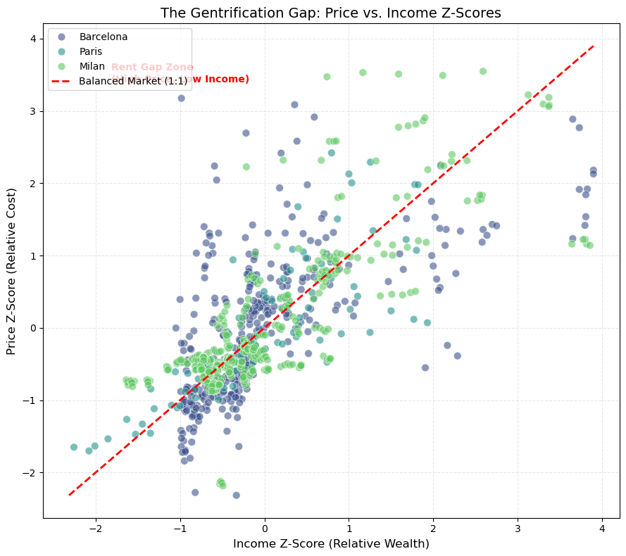
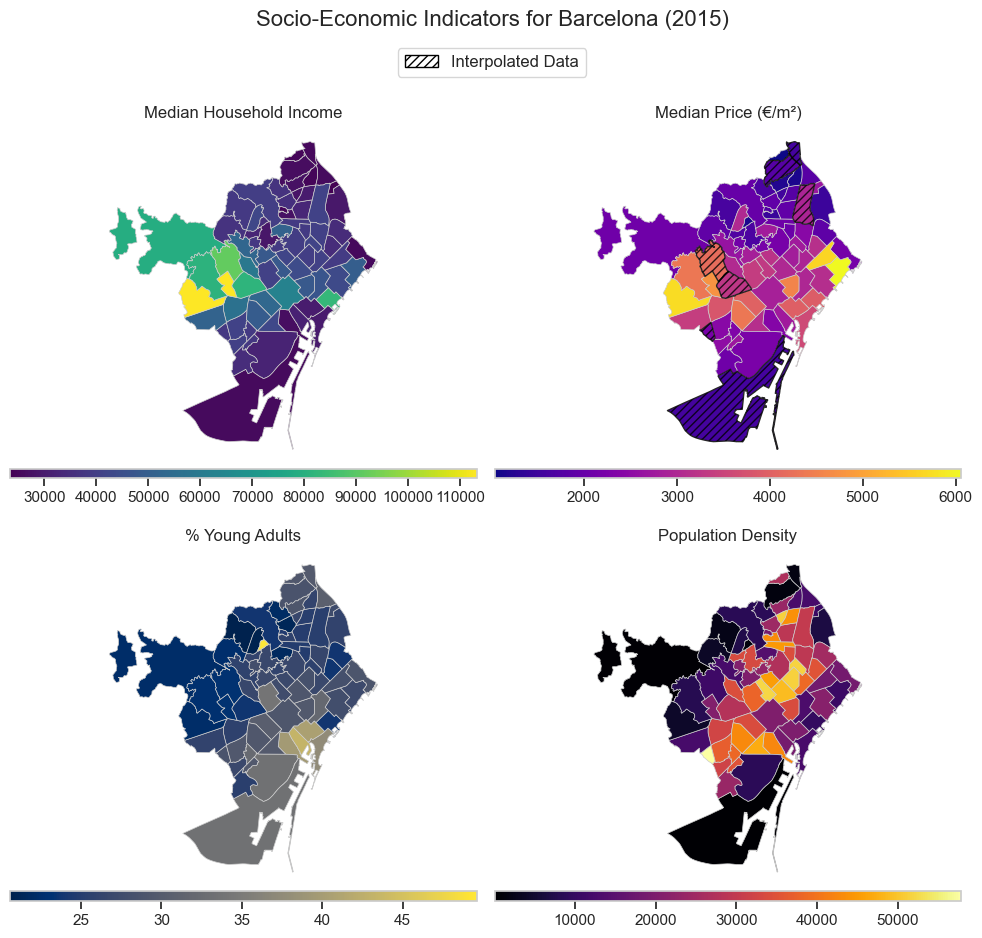
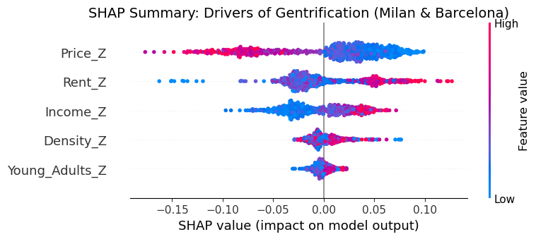

# DALAS: Urban Gentrification Early Warning System

**A Machine Learning framework to predict socio-economic displacement in European metropolises (Milan, Barcelona, Paris).**


## 📌 Project Overview

Gentrification is often detected too late—only after residents have already been displaced. This project proposes a **Predictive Early Warning System** that uses historical socio-economic data and real-time real estate scraping to forecast the **"Gentrification Gap"**: the specific metric where housing prices decouple from local wages.

We analyzed the structural drivers of displacement across **Milan, Barcelona, and Paris**, combining official census data with granular scraped listings from **Idealista** and **InsideAirbnb**.

---

## 📊 Key Results & Visualizations

### 1. The "Rent Gap" Mechanics
Our analysis confirmed the *Rent Gap Theory*: displacement pressure is highest where the mismatch between potential value (Price) and current population status (Income) is greatest.


*> **Figure 1:** The Gentrification Gap. Neighborhoods above the red dashed line are "overheated," where prices have decoupled from local purchasing power.*

### 2. Spatial Heterogeneity
Gentrification is not random; it clusters spatially. We used **Spatial KNN Imputation** to map these dynamics even where official census data was missing.


*> **Figure 2:** Spatial decoupling in Barcelona. High prices (Top Right) have invaded low-income historical districts (Top Left), creating high-pressure displacement zones.*

### 3. Drivers of Displacement (SHAP)
Using **SHAP (SHapley Additive exPlanations)**, we identified that **Low Initial Price** is the strongest predictor of future price spikes. Investors do not target expensive areas; they target "undervalued" catch-up zones.


*> **Figure 3:** SHAP Summary Plot. Blue dots (Low Price) on the top row push the prediction to the right (High Gentrification), confirming the "Catch-Up" mechanic.*

---

## 🧠 Modeling Strategy

We framed the problem as a regression task predicting the **Delta Gentrification Gap ($\Delta G$)**.

*   **Algorithm:** Random Forest Regressor (Optimized via GridSearch).
*   **Validation Protocol A (Temporal):** Trained on 2015-2022, Tested on **Real-Time 2025 Data** (via Scraping).
    *   **Result:** $R^2 \approx 0.32$. The model successfully predicts 2025 market heat using lagged 2023 administrative data.
*   **Validation Protocol B (Spatial):** Trained on Milan/Barcelona, Tested on Paris.
    *   **Result:** Highlighted the need for local calibration due to "Domain Shift" in income distributions.

---

## 🛠 Technical Architecture

### 1. Data Pipeline & Spatial Imputation
*   Harmonized heterogeneous data sources (INSEE, ISTAT, Open Data).
*   Implemented **Spatial K-Nearest Neighbors (KNN)** to impute missing demographic years based on the "urban texture" of neighboring districts.

### 2. Advanced Scraping (The "Miner")
We built a robust, anti-detection scraper to harvest real-time ground truth data from **Idealista** and **SeLoger**.
*   **Tech Stack:** `Selenium`, `undetected-chromedriver`, `Pandas`.
*   **Features:**
    *   **Anti-Bot:** Rotates User-Agents, randomizes geometric scrolling patterns.
    *   **Session Persistence:** Batch processing with incremental CSV saving.
    *   **Granularity:** Extracts specific features like "Needs Renovation" vs "New Development".

### 3. Project Structure
```bash
/gentrification_project
|-- /data
|   |-- /processed/           # Final datasets used for modeling
|   |-- /raw/                 # Raw scraped logs and shapefiles
|
|-- /notebooks
|   |-- data_exploration.ipynb  # EDA, Spatial Maps, Outlier Analysis
|   |-- RFandSHAP.ipynb         # Model Training, Validation (2025), SHAP Analysis
|
|-- /scrapers
|   |-- idealista_scraper.py  # Production scraper for IT/ES markets
|   |-- config.py             # Path management
|
|-- /imgs                     # Figures generated for the report
|-- README.md
|-- requirements.txt
```

---

## 🚀 How to Run

### 1. Setup
```bash
git clone <repo-url>
cd gentrification_project
python -m venv .venv
source .venv/bin/activate  # or .venv\Scripts\activate on Windows
pip install -r requirements.txt
```

### 2. Run the Scraper (Optional)
To generate fresh 2025/2026 data for validation:
```bash
cd scrapers
python idealista_scraper.py
```

### 3. Run the Analysis
Launch Jupyter Lab to replicate the figures and models:
```bash
jupyter lab notebooks/RFandSHAP.ipynb
```


*Academic Project - Jan 2026*
